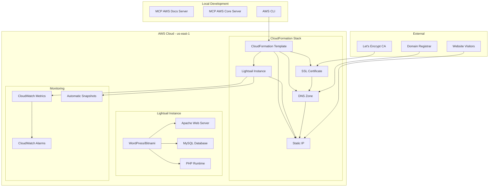
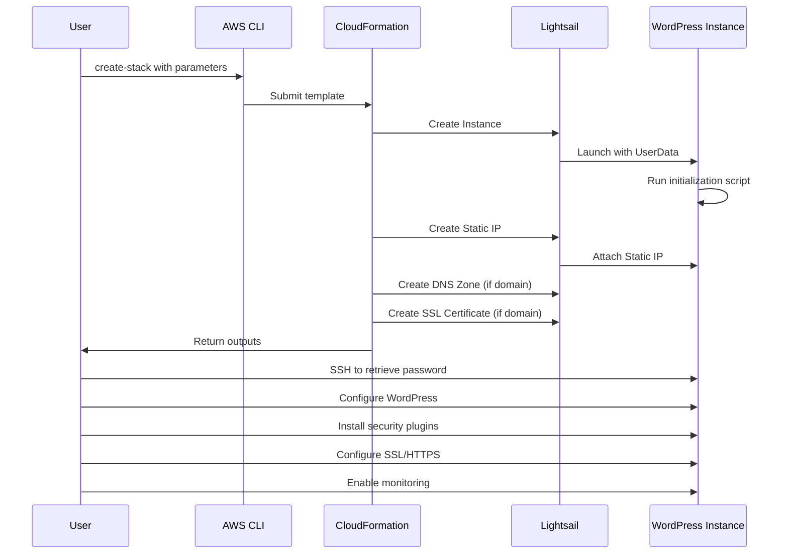

# Design Document

## Overview

This design document describes the architecture and implementation approach for deploying a production-ready WordPress blog on AWS Lightsail using Infrastructure as Code (CloudFormation) and Model Context Protocol (MCP) servers. The solution provides automated deployment, configuration, security hardening, performance optimization, and monitoring capabilities.

### Design Goals

- **Reproducibility**: All infrastructure defined as code for consistent deployments
- **Automation**: Minimize manual configuration through initialization scripts and automation tools
- **Security**: Implement defense-in-depth with firewalls, SSL/HTTPS, security plugins, and access controls
- **Reliability**: Automated backups and monitoring to ensure high availability
- **Performance**: Caching, optimization, and appropriate resource sizing
- **Maintainability**: Clear documentation access via MCP servers and automation scripts
- **Cost-Effectiveness**: Optimize for ~$14/month operational costs

### Technology Stack

- **Infrastructure**: AWS Lightsail, CloudFormation
- **Platform**: Bitnami WordPress Stack (Apache, MySQL, PHP)
- **Automation**: Bash scripts, WP-CLI, AWS CLI
- **Documentation**: MCP AWS Documentation Server, MCP AWS Core
- **Monitoring**: CloudWatch Metrics and Alarms
- **Security**: Let's Encrypt SSL, Wordfence, Limit Login Attempts
- **Performance**: WP Super Cache, Smush, Redis (optional)

## Architecture

### High-Level Architecture



### Deployment Flow



### Network Architecture

- **Region**: us-east-1 (London)
- **Availability Zone**: us-east-1a (configurable to us-east-1b or us-east-1c)
- **Static IP**: Public IPv4 address attached to instance
- **Firewall**: Instance-level firewall with port-based rules
- **DNS**: Lightsail-managed DNS zone with A records
- **SSL/TLS**: Let's Encrypt certificates via Bitnami bncert-tool

## Components and Interfaces

### 1. CloudFormation Template

**Purpose**: Define all infrastructure resources as code

**Key Components**:
- Parameters: User-configurable values (instance name, size, domain, email, etc.)
- Conditions: Logic for optional resources (domain, SSL, snapshots)
- Resources: AWS resources to create (instance, static IP, DNS, SSL)
- Outputs: Values to return to user (URLs, IP addresses, SSH commands)

**Parameters**:
```yaml
InstanceName: String (pattern: ^[a-z0-9-]+$)
InstancePlan: String (micro_2_0 | small_2_0 | medium_2_0 | large_2_0)
AvailabilityZone: String (us-east-1a | us-east-1b | us-east-1c)
DomainName: String (optional)
AdminEmail: String (email pattern validation)
EnableAutomaticSnapshots: String (true | false)
```

**Resources**:
- `WordPressInstance`: AWS::Lightsail::Instance
- `StaticIP`: AWS::Lightsail::StaticIp
- `InstanceFirewall`: AWS::Lightsail::Instance (networking configuration)
- `DNSZone`: AWS::Lightsail::Domain (conditional)
- `SSLCertificate`: AWS::Lightsail::Certificate (conditional)

**Outputs**:
- InstanceName: Name of created instance
- StaticIPAddress: Public IP address
- WordPressURL: HTTP URL to access site
- WordPressAdminURL: HTTP URL to access admin panel
- SSHCommand: Command to SSH into instance
- DomainNameServers: Nameservers for domain configuration (conditional)
- NextSteps: Post-deployment instructions

### 2. Lightsail Instance

**Purpose**: Host WordPress application and database

**Configuration**:
- Blueprint: wordpress (Bitnami WordPress Stack)
- Bundle: Configurable (micro_2_0 to large_2_0)
- Region: us-east-1
- Availability Zone: Configurable within us-east-1
- Tags: Environment, Application, ManagedBy, Region

**Networking**:
- Port 22 (SSH): Open to 0.0.0.0/0
- Port 80 (HTTP): Open to 0.0.0.0/0
- Port 443 (HTTPS): Open to 0.0.0.0/0
- All other ports: Blocked

**Storage**:
- Root volume: Included in bundle (40GB to 160GB SSD)
- Backup directory: /opt/bitnami/backups

### 3. User Data Script

**Purpose**: Automate initial instance configuration

**Execution Flow**:
1. Wait 60 seconds for Bitnami initialization
2. Update system packages (apt-get update && upgrade)
3. Set WordPress directory permissions
4. Configure PHP settings for performance
5. Restart Apache and PHP-FPM services
6. Create backup directory
7. Log completion timestamp

**PHP Configuration Changes**:
- memory_limit: 256M
- upload_max_filesize: 64M
- post_max_size: 64M
- max_execution_time: 300 seconds

**File Permissions**:
- Directories: 755 (rwxr-xr-x)
- Files: 644 (rw-r--r--)
- Owner: bitnami:daemon

### 4. Static IP

**Purpose**: Provide persistent public IP address

**Configuration**:
- Name: {InstanceName}-static-ip
- Attached to: WordPressInstance
- Region: us-east-1

**Behavior**:
- Persists across instance stops/starts
- Persists across instance replacements (if manually reattached)
- Free while attached to running instance
- Charged if detached or instance stopped

### 5. DNS Zone (Optional)

**Purpose**: Manage DNS records for custom domain

**Configuration**:
- Domain: User-provided domain name
- A Records:
  - Apex domain → Static IP
  - www subdomain → Static IP

**Integration**:
- Requires nameserver update at domain registrar
- Provides Lightsail nameservers in stack outputs
- DNS propagation typically takes 1-48 hours

### 6. SSL Certificate (Optional)

**Purpose**: Enable HTTPS for custom domain

**Configuration**:
- Certificate Name: {InstanceName}-ssl-cert
- Domain: User-provided domain
- Subject Alternative Names: www.{domain}
- Validation: DNS validation via Lightsail

**Lifecycle**:
- Created by CloudFormation
- Validated via DNS records
- Installed on instance via Bitnami bncert-tool
- Auto-renewed by Let's Encrypt

### 7. WordPress Installation

**Purpose**: Provide content management system

**Components**:
- WordPress Core: Latest stable version
- Database: MySQL (included in Bitnami stack)
- Web Server: Apache 2.4
- PHP: Version included in Bitnami stack
- Default Admin User: "user" (to be replaced)

**Configuration Files**:
- WordPress: /opt/bitnami/wordpress/
- wp-config.php: /opt/bitnami/wordpress/wp-config.php
- Apache config: /opt/bitnami/apache2/conf/
- PHP config: /opt/bitnami/php/etc/php.ini

**Initial Credentials**:
- Username: user
- Password: Stored in /home/bitnami/bitnami_application_password

### 8. Security Plugins

**Purpose**: Protect WordPress from attacks

**Plugins**:
1. **Wordfence**: Web application firewall, malware scanner, login security
2. **Limit Login Attempts Reloaded**: Brute force protection
3. **UpdraftPlus**: Backup and restore functionality

**Installation Method**: WP-CLI commands via SSH

**Configuration**: Default settings with manual tuning post-deployment

### 9. Performance Plugins

**Purpose**: Optimize site speed and resource usage

**Plugins**:
1. **WP Super Cache**: Page caching to reduce server load
2. **Smush**: Image compression and optimization
3. **Redis Cache** (Optional): Object caching for database queries

**Installation Method**: WP-CLI commands via SSH

**Configuration**:
- WP Super Cache: Enabled immediately after installation
- Smush: Requires manual configuration
- Redis: Requires Redis server installation first

### 10. Backup System

**Purpose**: Protect against data loss

**Components**:
1. **Automatic Snapshots**: Lightsail-managed daily snapshots
2. **Manual Snapshots**: On-demand full instance backups
3. **UpdraftPlus**: WordPress-level backups

**Automatic Snapshot Configuration**:
- Schedule: Daily at 03:00 UTC
- Retention: 7 most recent snapshots
- Scope: Full instance (OS, WordPress, database)

**Manual Snapshot Naming**: wordpress-{purpose}-YYYYMMDD

### 11. Monitoring System

**Purpose**: Track performance and alert on issues

**Components**:
1. **CloudWatch Metrics**: CPU, network, disk metrics
2. **CloudWatch Alarms**: Threshold-based alerts
3. **Health Check Script**: Automated status verification

**Metrics Collected**:
- CPUUtilization: Percentage of CPU in use
- NetworkIn: Bytes received
- NetworkOut: Bytes transmitted

**Alarms**:
- wordpress-high-cpu: Triggers when CPU > 80% for 2 periods

**Health Check Script**:
- Frequency: Daily (user-scheduled)
- Checks: Instance state, CPU metrics
- Output: Text summary

### 12. MCP Servers

**Purpose**: Provide automated access to AWS documentation and expertise

**Servers**:
1. **aws-docs**: AWS Documentation MCP Server
   - Package: awslabs.aws-documentation-mcp-server
   - Tools: search_documentation, read_documentation, recommend
   - Auto-approved: search_documentation, read_documentation

2. **aws-core**: AWS Core MCP Server
   - Package: mcp-aws-core
   - Tools: prompt_understanding
   - Auto-approved: prompt_understanding

**Configuration Location**: .kiro/settings/mcp.json

**Usage**:
- Search AWS documentation during deployment
- Get expert guidance on best practices
- Troubleshoot issues with automated documentation lookup

### 13. Automation Scripts

**Purpose**: Automate routine maintenance tasks

**Scripts**:
1. **daily-health-check.sh**: Check instance state and metrics
2. **verify-backups.sh**: List recent snapshots

**Health Check Script**:
- Queries instance state via AWS CLI
- Retrieves CPU metrics for past hour
- Outputs results to console

**Backup Verification Script**:
- Lists 7 most recent snapshots
- Outputs JSON with snapshot details
- Can be scheduled weekly

## Data Models

### CloudFormation Stack State

```yaml
StackName: string
StackStatus: CREATE_COMPLETE | UPDATE_COMPLETE | DELETE_COMPLETE | etc.
Parameters:
  - ParameterKey: string
    ParameterValue: string
Resources:
  - LogicalResourceId: string
    PhysicalResourceId: string
    ResourceType: string
    ResourceStatus: string
Outputs:
  - OutputKey: string
    OutputValue: string
    ExportName: string (optional)
```

### Lightsail Instance State

```yaml
InstanceName: string
AvailabilityZone: string
BlueprintId: wordpress
BundleId: string
State:
  Code: number
  Name: running | stopped | pending | etc.
PublicIpAddress: string (static IP)
PrivateIpAddress: string
Networking:
  Ports:
    - FromPort: number
      ToPort: number
      Protocol: tcp | udp
      AccessFrom: string
Tags:
  - Key: string
    Value: string
```

### Snapshot State

```yaml
SnapshotName: string
CreatedAt: timestamp
State: available | creating | error
SizeInGb: number
FromInstanceName: string
FromInstanceArn: string
```

### WordPress Configuration

```php
// wp-config.php additions
define('WP_HOME', 'https://domain.com');
define('WP_SITEURL', 'https://domain.com');
define('WP_CACHE', true); // For caching plugins
define('WP_REDIS_HOST', 'localhost'); // If Redis enabled
```

## Error Handling

### CloudFormation Stack Creation Failures

**Potential Causes**:
- Invalid parameter values
- Resource limits exceeded
- Insufficient permissions
- Service quotas reached
- Network connectivity issues

**Detection**:
- Stack status: CREATE_FAILED, ROLLBACK_IN_PROGRESS, ROLLBACK_COMPLETE
- CloudFormation events show specific resource failures

**Recovery**:
1. Query stack events: `aws cloudformation describe-stack-events`
2. Identify failed resource and error message
3. Correct parameter or configuration issue
4. Delete failed stack
5. Retry stack creation with corrected parameters

**Prevention**:
- Validate parameters before submission
- Check service quotas in advance
- Use MCP servers to verify configuration

### Instance Initialization Failures

**Potential Causes**:
- User data script errors
- Package installation failures
- Insufficient disk space
- Network connectivity issues

**Detection**:
- WordPress not accessible after expected initialization time
- SSH connection shows incomplete setup
- Log file /var/log/wordpress-init.log missing or incomplete

**Recovery**:
1. SSH to instance
2. Check /var/log/cloud-init-output.log for errors
3. Manually run failed commands
4. Restart services if needed
5. Create snapshot before attempting fixes

**Prevention**:
- Test user data script in development environment
- Add error handling to script
- Include logging at each step

### SSL Certificate Validation Failures

**Potential Causes**:
- DNS not propagated
- Incorrect nameservers at registrar
- Domain validation timeout
- Certificate limit reached

**Detection**:
- Certificate status: VALIDATION_TIMED_OUT, FAILED
- HTTPS not working after configuration
- Browser shows certificate errors

**Recovery**:
1. Verify DNS propagation: `nslookup domain.com`
2. Check nameservers at registrar
3. Wait for DNS propagation (up to 48 hours)
4. Retry certificate validation
5. Use MCP to search Let's Encrypt troubleshooting docs

**Prevention**:
- Update nameservers before creating certificate
- Verify DNS propagation before SSL configuration
- Use DNS checking tools

### WordPress Admin Access Issues

**Potential Causes**:
- Password file not readable
- Incorrect SSH key
- Instance not fully initialized
- Firewall blocking SSH

**Detection**:
- Cannot SSH to instance
- Password file empty or missing
- WordPress admin login fails

**Recovery**:
1. Verify SSH key path and permissions
2. Check instance state via AWS CLI
3. Verify firewall rules allow port 22
4. Wait for initialization to complete
5. Use Lightsail console browser-based SSH as fallback

**Prevention**:
- Ensure SSH key exists before deployment
- Wait adequate time for initialization
- Test SSH access immediately after deployment

### Backup Failures

**Potential Causes**:
- Insufficient snapshot quota
- Instance in transitional state
- Service outage

**Detection**:
- Snapshot status: FAILED
- Automatic snapshots not appearing
- Backup verification script shows gaps

**Recovery**:
1. Check snapshot quota
2. Verify instance is in stable state
3. Manually create snapshot to test
4. Contact AWS support if persistent

**Prevention**:
- Monitor snapshot quota usage
- Verify automatic snapshot configuration
- Run backup verification script weekly

### Performance Degradation

**Potential Causes**:
- Insufficient instance resources
- Database not optimized
- Caching not configured
- High traffic volume
- Plugin conflicts

**Detection**:
- CloudWatch alarm triggers (CPU > 80%)
- Slow page load times
- Increased response times

**Recovery**:
1. Check CloudWatch metrics
2. Identify resource bottleneck
3. Optimize database queries
4. Enable/configure caching
5. Update stack to larger instance plan if needed

**Prevention**:
- Right-size instance from start
- Configure caching during initial setup
- Monitor metrics regularly
- Set up CloudWatch alarms

## Testing Strategy

### Unit Testing

**Scope**: Individual components and scripts

**Test Cases**:
1. **CloudFormation Template Validation**
   - Validate template syntax: `aws cloudformation validate-template`
   - Verify parameter constraints
   - Check condition logic
   - Validate output expressions

2. **User Data Script Testing**
   - Test script syntax: `bash -n user-data.sh`
   - Verify command availability
   - Test file permission operations
   - Verify log file creation

3. **Automation Script Testing**
   - Test health check script with mock data
   - Test backup verification script with mock snapshots
   - Verify error handling
   - Test output formatting

### Integration Testing

**Scope**: Component interactions and workflows

**Test Cases**:
1. **Stack Creation Flow**
   - Create stack with minimal parameters
   - Verify all resources created
   - Check resource dependencies
   - Validate outputs

2. **Instance Initialization**
   - Deploy instance
   - Wait for initialization
   - SSH to instance
   - Verify WordPress accessible
   - Check log file completion

3. **Static IP Attachment**
   - Create instance and static IP
   - Verify IP attached
   - Stop and start instance
   - Verify IP persists

4. **DNS and SSL Configuration**
   - Create stack with domain
   - Verify DNS zone created
   - Check A records
   - Verify SSL certificate created

5. **Backup System**
   - Enable automatic snapshots
   - Wait 24 hours
   - Verify snapshot created
   - Create manual snapshot
   - Verify both snapshots listed

### System Testing

**Scope**: End-to-end deployment and operation

**Test Cases**:
1. **Complete Deployment Without Domain**
   - Create stack with all parameters except domain
   - Wait for completion
   - Retrieve admin password
   - Access WordPress admin
   - Change admin password
   - Install security plugins
   - Install performance plugins
   - Create test post
   - Verify site accessible

2. **Complete Deployment With Domain**
   - Create stack with domain parameter
   - Update nameservers at registrar
   - Wait for DNS propagation
   - Configure SSL via bncert-tool
   - Update wp-config.php
   - Verify HTTPS working
   - Verify HTTP redirects to HTTPS
   - Test certificate auto-renewal

3. **Stack Update**
   - Create stack with small_2_0 plan
   - Update stack to medium_2_0 plan
   - Verify instance resized
   - Verify data preserved
   - Verify static IP unchanged

4. **Stack Deletion**
   - Create manual snapshot
   - Delete stack
   - Verify all resources removed
   - Verify snapshot preserved

### Performance Testing

**Scope**: Resource usage and response times

**Test Cases**:
1. **Baseline Performance**
   - Measure page load time (uncached)
   - Measure page load time (cached)
   - Measure admin panel response time
   - Record CPU and memory usage

2. **Load Testing**
   - Simulate 10 concurrent users
   - Simulate 50 concurrent users
   - Monitor CPU utilization
   - Monitor response times
   - Verify CloudWatch alarms trigger appropriately

3. **Caching Effectiveness**
   - Measure load time without cache
   - Enable WP Super Cache
   - Measure load time with cache
   - Calculate improvement percentage

### Security Testing

**Scope**: Security controls and vulnerabilities

**Test Cases**:
1. **Firewall Rules**
   - Verify port 22, 80, 443 accessible
   - Verify other ports blocked
   - Test from external IP

2. **SSL/TLS Configuration**
   - Verify certificate valid
   - Check certificate expiration date
   - Test SSL Labs rating
   - Verify HTTP to HTTPS redirect

3. **WordPress Security**
   - Verify default admin user removed
   - Test login attempt limiting
   - Verify Wordfence active
   - Check for outdated plugins/themes

4. **Access Controls**
   - Verify password file permissions
   - Check WordPress file permissions
   - Test SSH key authentication

### Monitoring Testing

**Scope**: Monitoring and alerting functionality

**Test Cases**:
1. **CloudWatch Metrics**
   - Verify metrics publishing
   - Check metric data points
   - Verify metric retention

2. **CloudWatch Alarms**
   - Trigger high CPU alarm (stress test)
   - Verify alarm state changes
   - Verify alarm notifications (if configured)

3. **Health Check Script**
   - Run health check script
   - Verify instance state retrieved
   - Verify metrics retrieved
   - Check output format

4. **Backup Verification Script**
   - Run backup verification script
   - Verify snapshots listed
   - Check output format

### MCP Server Testing

**Scope**: MCP server functionality and integration

**Test Cases**:
1. **AWS Documentation Server**
   - Search for "Lightsail CloudFormation"
   - Read documentation page
   - Verify markdown formatting
   - Test recommendation feature

2. **AWS Core Server**
   - Query for best practices
   - Verify expert guidance provided
   - Test with various AWS topics

### Acceptance Testing

**Scope**: User-facing functionality and requirements

**Test Cases**:
- Verify all 15 requirements from requirements.md
- Test each acceptance criterion
- Document any deviations
- Obtain user sign-off

**Acceptance Criteria Verification Matrix**:
- Requirement 1: CloudFormation deployment ✓
- Requirement 2: Static IP persistence ✓
- Requirement 3: Firewall configuration ✓
- Requirement 4: Domain and SSL ✓
- Requirement 5: Automatic initialization ✓
- Requirement 6: Automated backups ✓
- Requirement 7: Security plugins ✓
- Requirement 8: Performance optimization ✓
- Requirement 9: CloudWatch monitoring ✓
- Requirement 10: Stack updates ✓
- Requirement 11: Stack deletion ✓
- Requirement 12: MCP configuration ✓
- Requirement 13: Automation scripts ✓
- Requirement 14: SSL/HTTPS ✓
- Requirement 15: Admin credentials ✓

## Implementation Considerations

### Development Environment

- **Local Machine**: Windows with PowerShell/CMD
- **AWS CLI**: Configured with appropriate credentials and region
- **Text Editor**: For template and script editing
- **MCP Servers**: Configured in Kiro for documentation access

### Deployment Phases

1. **Phase 1: Pre-Deployment** (5 minutes)
   - Verify AWS CLI configuration
   - Use MCP for best practices guidance
   - Search AWS documentation

2. **Phase 2: Stack Deployment** (10 minutes)
   - Create CloudFormation stack
   - Monitor stack creation
   - Wait for completion

3. **Phase 3: Information Retrieval** (2 minutes)
   - Get stack outputs
   - Save important values

4. **Phase 4: WordPress Configuration** (10 minutes)
   - Retrieve admin password
   - Access admin panel
   - Configure settings

5. **Phase 5: SSL Configuration** (15 minutes)
   - Update nameservers
   - Wait for DNS propagation
   - Configure SSL via bncert-tool
   - Update WordPress URLs

6. **Phase 6: Backup Configuration** (5 minutes)
   - Enable automatic snapshots
   - Verify configuration
   - Create baseline snapshot

7. **Phase 7: Security Hardening** (15 minutes)
   - Install security plugins
   - Update components
   - Create new admin user
   - Remove default user

8. **Phase 8: Performance Optimization** (10 minutes)
   - Install caching plugin
   - Install image optimization
   - Configure Redis (optional)

9. **Phase 9: Monitoring Setup** (5 minutes)
   - Enable CloudWatch metrics
   - Create alarms
   - Test health check script

### Cost Optimization

**Monthly Cost Breakdown**:
- Instance (small_2_0): $10
- Static IP (attached): $0
- Data transfer: Included
- Snapshots (7 × 60GB × $0.05): ~$3
- Domain (Route 53): ~$1
- **Total**: ~$14/month

**Optimization Strategies**:
- Start with micro_2_0 ($5/month) for low-traffic sites
- Scale up only when metrics indicate need
- Limit snapshot retention to 7 days
- Use Lightsail DNS instead of Route 53 (saves $1/month)
- Monitor data transfer to avoid overages

### Security Best Practices

1. **Restrict SSH Access**: Update firewall to allow only specific IPs
2. **Strong Passwords**: Use password manager for admin credentials
3. **Regular Updates**: Keep WordPress, plugins, and themes updated
4. **Security Plugins**: Configure Wordfence and login limiting
5. **SSL/HTTPS**: Always use HTTPS for admin and frontend
6. **Backup Verification**: Regularly test snapshot restoration
7. **Monitoring**: Review CloudWatch metrics weekly
8. **Least Privilege**: Remove unnecessary user accounts

### Maintenance Schedule

**Daily**:
- Automatic snapshots (03:00 UTC)
- Health check script (optional)

**Weekly**:
- Review CloudWatch metrics
- Run backup verification script
- Check for WordPress/plugin updates

**Monthly**:
- Review and optimize costs
- Test snapshot restoration
- Review security plugin reports
- Analyze performance metrics

**Quarterly**:
- Review and update firewall rules
- Audit user accounts
- Review and optimize instance sizing
- Update automation scripts

### Troubleshooting Resources

1. **MCP AWS Documentation Server**: Search for specific error messages
2. **MCP AWS Core Server**: Get expert guidance on issues
3. **CloudFormation Events**: Detailed error messages for stack failures
4. **Instance Logs**: /var/log/cloud-init-output.log, /var/log/wordpress-init.log
5. **WordPress Debug**: Enable WP_DEBUG in wp-config.php
6. **AWS Support**: For service-level issues

### Future Enhancements

**Potential Improvements**:
1. **CDN Integration**: Add CloudFront for global content delivery
2. **Database Optimization**: Implement external RDS database
3. **Multi-Region**: Deploy in multiple regions for redundancy
4. **CI/CD Pipeline**: Automate WordPress updates and deployments
5. **Advanced Monitoring**: Add custom CloudWatch dashboards
6. **Cost Alerts**: Set up billing alarms
7. **Automated Testing**: Implement automated acceptance tests
8. **Blue-Green Deployments**: Zero-downtime updates
9. **Container Migration**: Move to containerized WordPress (ECS/Fargate)
10. **Infrastructure Testing**: Add CloudFormation testing framework

## Conclusion

This design provides a comprehensive, production-ready solution for deploying WordPress on AWS Lightsail using Infrastructure as Code principles. The architecture balances simplicity, security, performance, and cost-effectiveness while providing automation and monitoring capabilities. The use of MCP servers enhances the deployment and maintenance experience by providing instant access to AWS documentation and expertise.
